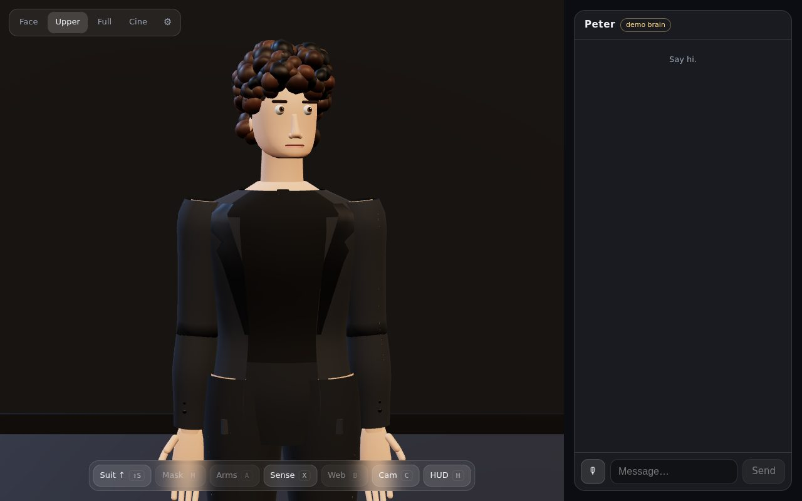
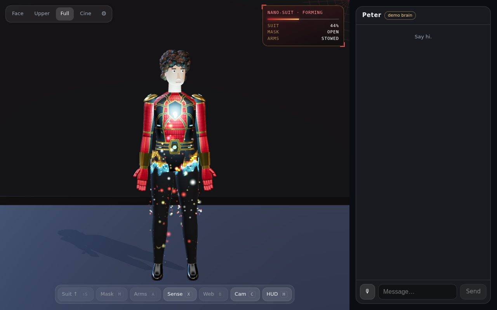
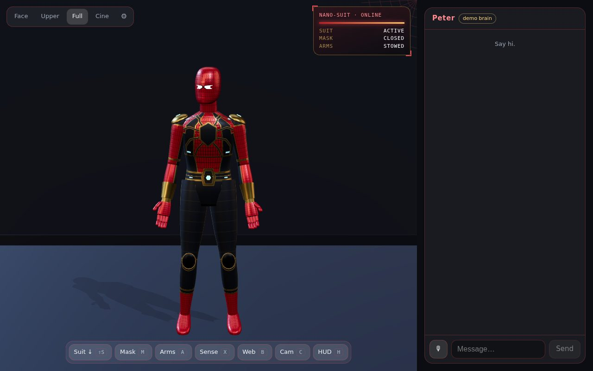
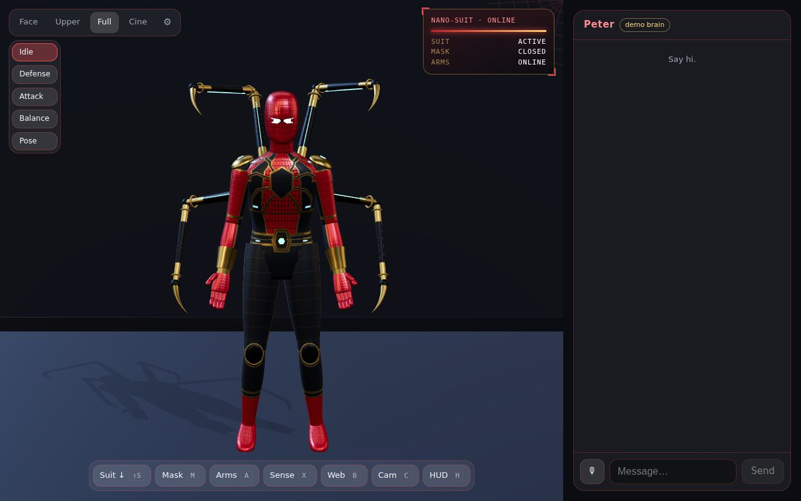
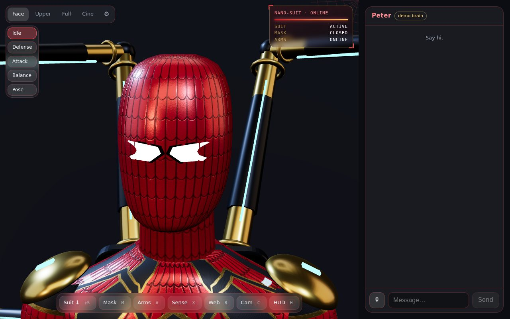
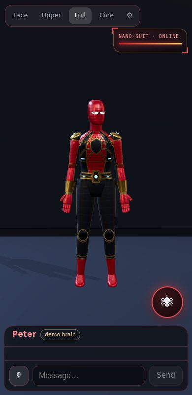

# SPIDER-AI

> A living 3D AI character in your browser. **Peter** — a curious, slightly awkward, quick-witted civilian — talks, remembers you, reacts with his whole body… and on command
> **suits up** into a nanotech Spider suit in a 2.5-second particle-and-shader transformation, deploys four mechanical spider arms, and keeps the same memories and personality.

Web / PWA · TypeScript · React · Three.js (React Three Fiber) · custom GLSL · WebAudio · Claude API (server-side).

| Civilian | Nanotech transformation | Spider suit |
|:--:|:--:|:--:|
|  |  |  |
| **Spider arms** | **Mask / face camera** | **Mobile** |
|  |  |  |

*(Screenshots are software-rendered in headless Chromium; real GPUs add bloom, MSAA and higher texture tiers.)*

## Features
* **Character** — procedural 7.6-head humanoid on a shared 19-bone rig; blinking, look-at (eyes lead, head follows, idle glances), breathing, 20+ gestures, emotion-driven posture, viseme lip-sync, deformable face (brows, lids, mouth) and deformable mask lenses.
* **Personality engine** — layered prompt files in [`/personality`](personality) (identity, speech style, humour, emotion, relationships, hero mode, rules, examples), **structured JSON output** (emotion, intensity, gesture, face, eyes, look-at, suit/arm actions, memory candidate), hidden variables (trust, stress, energy…), hero-mode modifiers.
* **Memory** — short-term, long-term, user facts, importance scores with decay, dedupe, retrieval, rolling summaries, secret filtering; device / session / Supabase storage.
* **Nanotech transformation** — per-region reveal shader with hex-cell sparks and burn edges, 800–10 000 GPU particles, reverse transformation (mask → neck → arms → chest → legs), cinematic camera, synthesised SFX, cooler lighting, Spider HUD.
* **Mask** — opens jaw→forehead, closes sides→centre; mesh-based lenses with six expressions.
* **Spider arms** — four gold arms, Z-fold stowage, hatch → base → segment → segment → claw deploy, two-bone IK, modes: Idle / Defense / Attack / Balance (crouch) / Pose.
* **Spider sense** (desaturation, outline pulse, ripples, camera kick) and **web shooter**.
* **Voice** — speech-to-text, TTS adapters (browser voices or any OpenAI-compatible endpoint), emotion-modulated synthetic hero voice, karaoke subtitles.
* **Responsive PWA** — desktop split view, mobile fullscreen + chat drawer + floating control wheel (long-press = suit), installable, offline shell.
* **Quality** — AUTO / LOW / MEDIUM / HIGH / ULTRA, device scoring, FPS governor, 3-level LOD, optional bloom.
* **Accessibility** — keyboard controls, reduced-motion, subtitles, text size, mute, voice off, ARIA labels, focus-trapped dialogs.

## Quick start
```bash
git clone <this repo> && cd spider-man
cp .env.example .env          # optional: add ANTHROPIC_API_KEY
npm install
npm run dev                   # http://localhost:5173
```
No API key? The app runs with an **offline demo brain** (chat header shows *demo brain*) so you can explore everything — transformation, arms, voice output, memory.

## Controls
| Desktop | Action | Mobile |
|---|---|---|
| **Shift + S** | Suit up / down | long-press 🕷 |
| **M** | Mask open / close | 🕷 → ◐ |
| **A** | Spider arms | 🕷 → ✳ |
| **C** | Camera mode (Full → Upper → Face → Cinematic) | 🕷 → ◎ |
| **H** | HUD | – |
| **V** | Voice input (push-to-talk toggle) | 🕷 → 🎙 |
| **X** / **B** | Spider sense / web shooter | 🕷 → ⚡ |
| **Esc** | Cancel voice / close dialogs | – |
| Mouse drag · scroll | Orbit · zoom | 1 finger · pinch |

Just *ask*: "슈트 입어봐", "suit up", "show me your face", "deploy your arms" — the AI can trigger these itself (gated by cooldowns; disable under Settings → Controls).

## Environment variables (server only)
| Var | Purpose |
|---|---|
| `ANTHROPIC_API_KEY` | Claude access (never sent to the browser) |
| `CLAUDE_MODEL` | default `claude-sonnet-5-5` |
| `CLAUDE_EFFORT` | `low` (default) / `medium` / `high` |
| `TTS_BASE_URL`, `TTS_API_KEY`, `TTS_MODEL`, `TTS_VOICE` | optional OpenAI-compatible speech endpoint |
| `SUPABASE_URL`, `SUPABASE_SERVICE_KEY` | optional cloud memory (see [docs/MEMORY.md](docs/MEMORY.md)) |

## Scripts
`npm run dev` · `npm run build` · `npm run preview` · `npm test` (Vitest) · `npm run test:e2e` (Playwright) · `npm run typecheck` · `npm run icons`

## Deployment
Connect the repo to Vercel: pushes to `main` deploy automatically ([docs/DEPLOY.md](docs/DEPLOY.md)). CI (`.github/workflows/ci.yml`) runs typecheck, unit tests, build, e2e and the transformation QA.

## Assets
Everything is procedural — no binary assets required. Drop a `public/models/character.glb` to replace the civilian body ([docs/MODELING_GUIDE.md](docs/MODELING_GUIDE.md), [docs/ASSET_PIPELINE.md](docs/ASSET_PIPELINE.md)). The three design references live in [`/reference`](reference).

## Docs
[Architecture](docs/ARCHITECTURE.md) · [Modeling guide](docs/MODELING_GUIDE.md) · [Memory](docs/MEMORY.md) · [Deploy](docs/DEPLOY.md) · [Asset pipeline](docs/ASSET_PIPELINE.md) · [QA report](docs/QA.md)

## Notes
SPIDER-AI is a fan project built around an *original* Peter-style character. It is not affiliated with Marvel or Sony. The voice is a synthetic preset and never imitates a real person; the civilian model is a stylised character, not a likeness.
